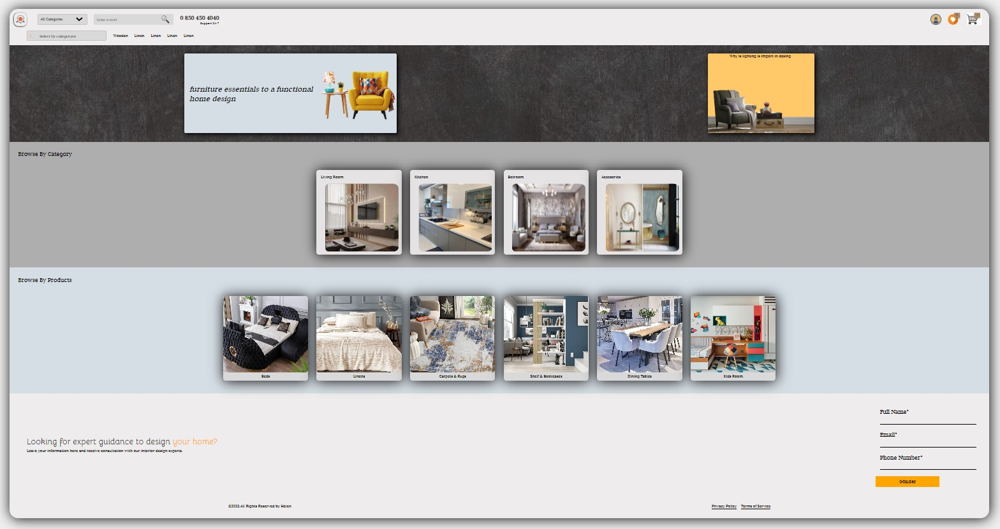

# Furniture app 🪑

## Technologies Used

- HTML
- CSS

## Live Demo

[Live Demo](#) 

## Screenshots

### Home Page

## How to Use

1. Clone the repository: `git clone [repository-url]`
2. Open the `index.html` file in your web browser.

## Customization

Feel free to customize the website according to your preferences. Update the images, content, and styles in the HTML and CSS files as needed.

## GitHub Repository

[GitHub Repository](https://github.com/Mehmet-github06) 

## License

This project is licensed under the MIT License - see the [LICENSE.md](LICENSE.md) file for details.

